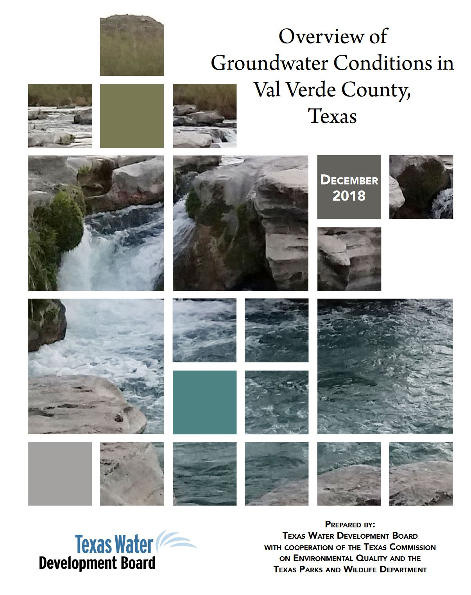
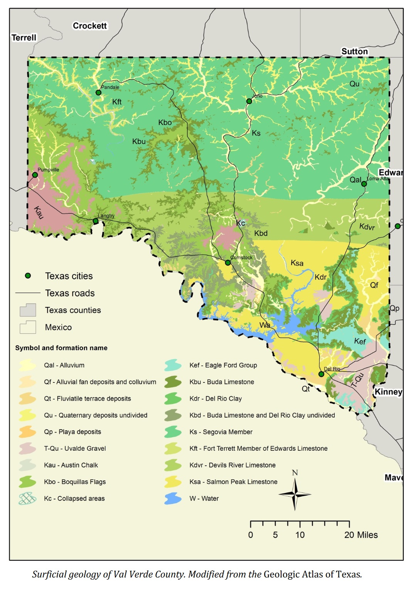
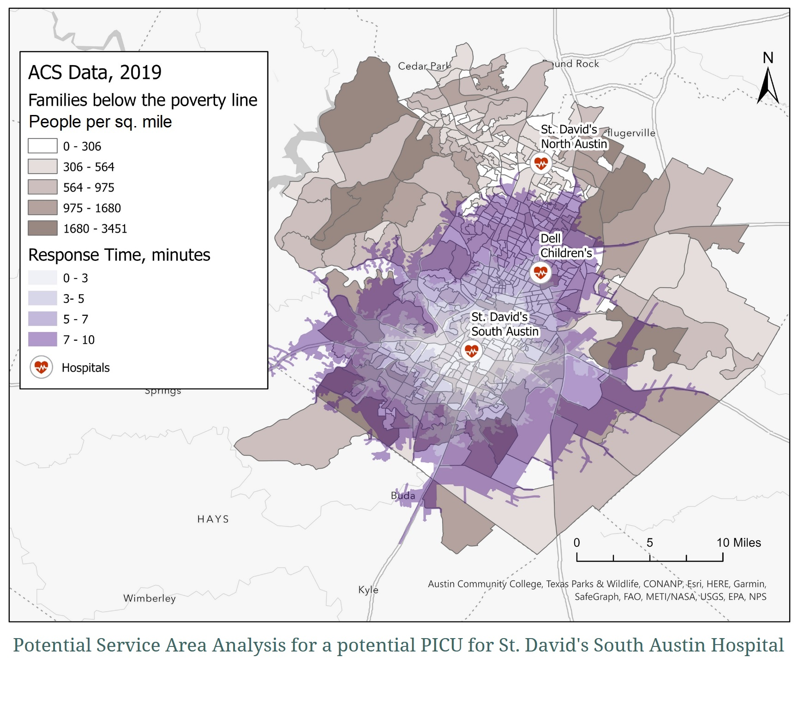
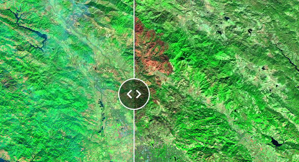
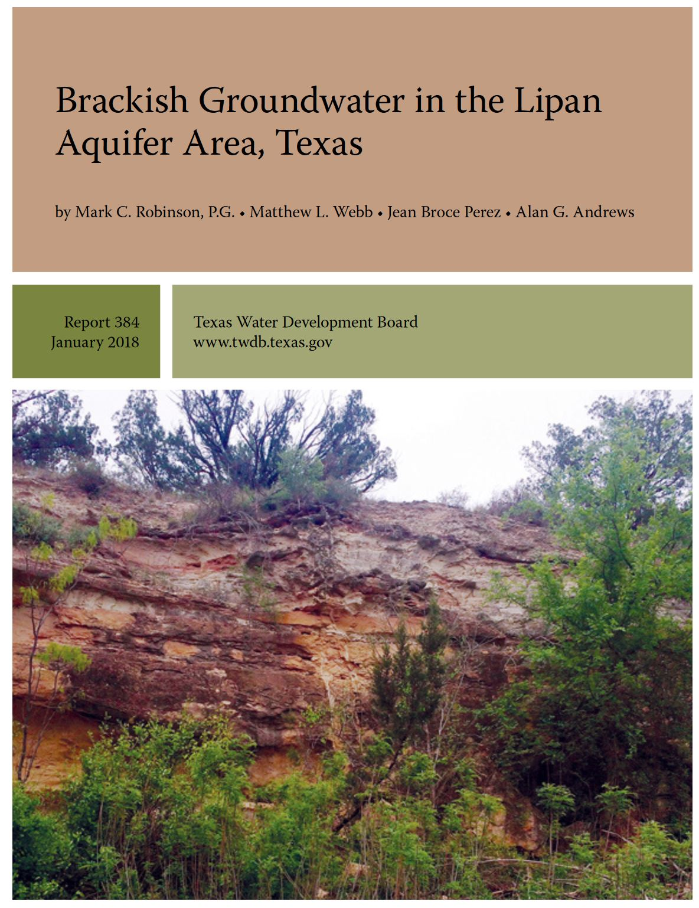

## Portfolio

---
### Geospatial Analysis

[Overview of Groundwater Conditions in Val Verde County,
Texas, Texas Water Development Board. December 2018](https://www.twdb.texas.gov/groundwater/special_projects/valverde/index.asp)

 Click the image above to see a copy of a selection of shapefiles from this report in ArcGIS Online 

[Austin Pediatric ICU Study, University of Oklahoma. December 2021](https://storymaps.arcgis.com/stories/9938c4c9cac14ab8a85c5ce09f297829)

[Google Earth Engine Application: Fires in Southern California]

---

### Formation Evaluation

- [Lipan Aquifer: Structure and Brackish Groundwater, Texas Water Development Board Report # 384, Co-Author, January 2018](https://www.twdb.texas.gov/groundwater/bracs/studies/Lipan/index.asp)

---

### Groundwater Use Analysis

- [Exempt Groundwater Use Report, Texas Water Development Board, August 2020](https://github.com/jbprz-OU/jeanbroceperez.github.io/raw/master/pdf/TWDB_EXEMPTGWUSE_REPORT.pdf)

---

Page template forked from <a href="https://github.com/evanca/quick-portfolio">evanca</a>

<!-- Remove above link if you don't want to attibute -->
