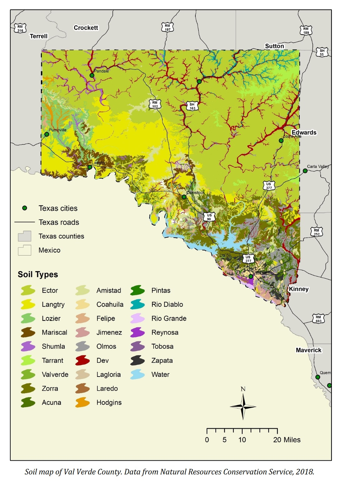

## Portfolio

---

### Geospatial Analysis

[Overview of
Groundwater Conditions in
Val Verde County,
Texas, Texas Water Development Board. December 2018](https://www.twdb.texas.gov/groundwater/special_projects/valverde/index.asp)

---
[Austin Pediatric ICU Study, University of Oklahoma. December 2021](https://storymaps.arcgis.com/stories/9938c4c9cac14ab8a85c5ce09f297829)

---
[Lipan Aquifer: Structure and Brackish Groundwater, Co-Author, January 2018](https://www.twdb.texas.gov/groundwater/bracs/studies/Lipan/index.asp)

---

### Category Name 2

- [Project 1 Title](http://example.com/)
- [Project 2 Title](http://example.com/)
- [Project 3 Title](http://example.com/)
- [Project 4 Title](http://example.com/)
- [Project 5 Title](http://example.com/)

---

---

Page template forked from <a href="https://github.com/evanca/quick-portfolio">evanca</a>

<!-- Remove above link if you don't want to attibute -->
